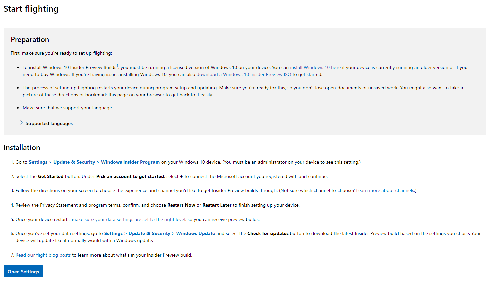
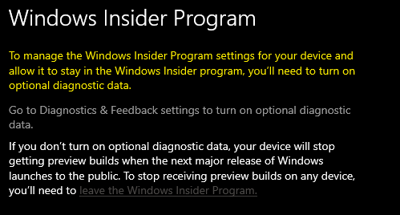
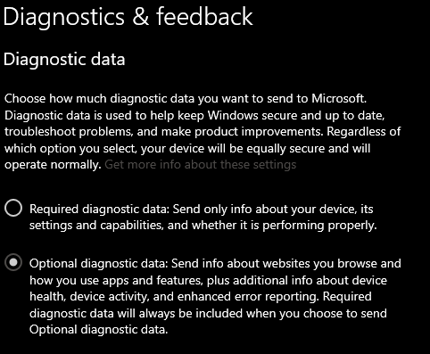
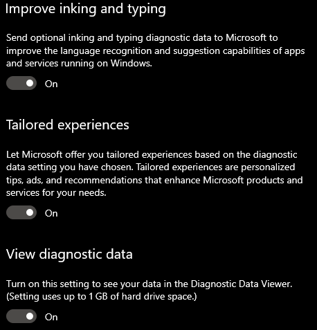
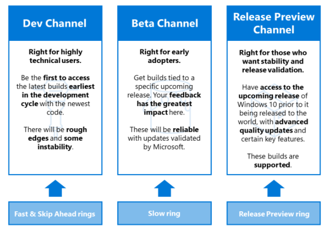
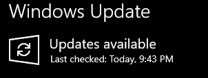

<br/><br/>
# Install WSL2 and Docker with GPU availiable

 - [Han](https://github.com/seunghwan1228) 
---

# Workstation Setting with Windows preview build and docker with gpu support

---

---
# 1) Windows Build > 20145 or higher
   - !! CAUTION: WINDOW VERSION 21327 Does not Work CUDA, so DO NOT USE THIS BUILD
<br/><br/><br/><br/>

## How to get Window Preview Build?
<br/><br/>
### 1. Log-in your window OS as Administrator


<br/><br/>

### 2. Join Window Insider Program

- Register as the same account with your OS logged-In

[https://insider.windows.com/en-us/register](https://insider.windows.com/en-us/register)

- Follow the Guid


<br/><br/>
## Need to change your update setting





<br/><br/>
## Set a Channel  - (I choosed Dev-Channel)


<br/><br/>
##  Start Update :smile:


Click
```
Check Update
```
there will the latest window build start with 21xxx (Mar.11 2021)

[Check Windows Insider Blog](https://blogs.windows.com/windows-insider/)

----------


install WSL2
install Ubuntu
install Docker
check gpu working
