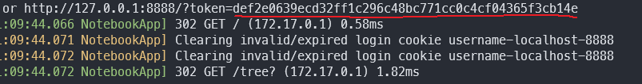

<br/><br/>
# Install WSL2 and Docker with GPU availiable

 - [Han](https://github.com/seunghwan1228) 
---

# ML/DL Envirionment Setting
# :one: Windows preview build
# :two: WSL2 
# :three: Docker with gpu support

---

# 1) Windows Build > 20145 or higher
   - !! CAUTION: WINDOW VERSION 21327 Does not Work CUDA, so DO NOT USE THIS BUILD
<br/><br/>
---
## How to get Window Preview Build?
<br/><br/>
### 1. Log-in your window OS as Administrator


<br/><br/>
------
### 2. Join Window Insider Program

- Register as the same account with your OS logged-In

[https://insider.windows.com/en-us/register](https://insider.windows.com/en-us/register)

You will see this after register

Click 
```
Get started
```


- Follow the Guid


<br/><br/>
## Need to change your update setting


```
click 

Go to Diagnostics & Feedback settings to turn on optinal diagnostic data.
```


<br/><br/>
------
## Set a Channel  - (I choosed Dev-Channel)


<br/><br/>
------
## Finally Ready to get Preview Build

<br/><br/>
##  Start Update :rocket:

Click
```
Check Update
```
there will the latest window build start with 21xxx (Mar.11 2021)


[Check Windows Insider Blog](https://blogs.windows.com/windows-insider/)

## After Update


requires to update additional features


## :ok_hand: Restart OS and check your workstation
<br/><br/>
-------
# 2) Install WSL2

Open PowerShell or CMD

Method :one:
``` powershell
wsl --install
```
<br/><br/>
----------------
Method :two:
```powershell
dism.exe /online /enable-feature /featurename:Microsoft-Windows-Subsystem-Linux /all /norestart

dism.exe /online /enable-feature /featurename:VirtualMachinePlatform /all /norestart
```
[Download Linux kernel](https://wslstorestorage.blob.core.windows.net/wslblob/wsl_update_x64.msi)

```
wsl --set-default-version 2
```

--------------------
<br/><br/>
# 3) Install Linux (I choose Ubuntu 20.04 LTS)
## Open Microsoft Store

Search
```
Ubuntu
```


## Option) Install Windows Terminal


<br/><br/>
- Terminal View


[Terminal Tips](https://endjin.com/blog/2020/05/5-tips-for-an-awesome-windows-terminal-experience)

Open CMD or Powershell

```
wsl -l -v
```


Additional Tip
```
Setting Configuration
```


:one: [My Setting File](assets/settings.json)

:two: [Ubuntu Icon](assets/ubuntu_32px.png)

:computer: I use Anaconda on my window system also. So I changed the first options as conda prompt


<br/><br/>

# install Docker and Cuda

## :exclamation: Make sure you have nvidia GPU already 
<br/><br/>

# :ferris_wheel: [Official Source - NVIDIA](https://docs.nvidia.com/cuda/wsl-user-guide/index.html)

## :zero: [Install NVIDIA Driver](https://developer.nvidia.com/cuda/wsl)

## :one: Follow the script
```bash
sudo apt-get update

sudo apt-get upgrade


# Requires to check your ubuntu version

sudo apt-key adv --fetch-keys http://developer.download.nvidia.com/compute/cuda/repos/ubuntu2004/x86_64/7fa2af80.pub

sudo sh -c 'echo "deb http://developer.download.nvidia.com/compute/cuda/repos/ubuntu2004/x86_64 /" > /etc/apt/sources.list.d/cuda.list'


sudo apt-get update

# Do not choose the cuda, cuda-11-0, or cuda-drivers meta-packages under WSL 2
#since these packages will result in an attempt to install the Linux NVIDIA driver under WSL 2.
sudo apt-get install -y cuda-toolkit-11-0
```

<br/><br/>
### In Ubuntu
After complete cuda toolkit installation, **Restart WSL2 in powershell or cmd on windows**
```Powershell
wsl --shutdown
```
<br/><br/>
Open Ubuntu(Linux), **Lets test gpu accelerator working** :rocket:
```bash
cd /usr/local/cuda/samples/1_Utilities/deviceQuery

sudo make

./deviceQuery
```


Test Another

```bash
cd /usr/local/cuda/samples/4_Finance/BlackScholes

sudo make

./BlackScholes
```


## :three: Install Docker

```bash
curl https://get.docker.com | sh

distribution=$(. /etc/os-release;echo $ID$VERSION_ID)

curl -s -L https://nvidia.github.io/nvidia-docker/gpgkey | sudo apt-key add -

curl -s -L https://nvidia.github.io/nvidia-docker/$distribution/nvidia-docker.list | sudo tee /etc/apt/sources.list.d/nvidia-docker.list

curl -s -L https://nvidia.github.io/libnvidia-container/experimental/$distribution/libnvidia-container-experimental.list | sudo tee /etc/apt/sources.list.d/libnvidia-container-experimental.list

sudo apt-get update

sudo apt-get install -y nvidia-docker2

```

Restart WSL2 - powershell
```powershell
wsl --shutdown
```
<br/><br/>
Open Ubuntu - bash
```bash
sudo service docker stop

sudo service docker start
```


## Additional Setting

:unlock: add user, so docker command can use not only root
```bash
sudo usermod -aG docker $USER

# To make ubuntu user can start docker
echo "$USER ALL=NOPASSWD:/usr/sbin/service docker *" | (sudo su -c 'EDITOR="tee" visudo -f /etc/sudoers.d/docker-service')

echo "$USER ALL=NOPASSWD:/usr/bin/mkdir /sys/fs/cgroup/systemd" | (sudo su -c 'EDITOR="tee" visudo -f /etc/sudoers.d/docker-mkdir')

echo "$USER ALL=NOPASSWD:/usr/bin/mount -t cgroup -o none\,name=systemd cgroup /sys/fs/cgroup/systemd" | (sudo su -c 'EDITOR="tee" visudo -f /etc/sudoers.d/docker-mount')

```

Update ~/.bashrc

[Copy  below]
```bash
cat << EOF >> ~/.bashrc
## Start docker if not already running
if [ "x\$(pgrep dockerd)" == "x" ]; then
    echo "Starting Docker..."
    sudo service docker start >/dev/null
    # Fix/mount systemd/cgroups too
    sudo mkdir /sys/fs/cgroup/systemd
    sudo mount -t cgroup -o none,name=systemd cgroup /sys/fs/cgroup/systemd
fi
EOF
```

### Restart WSL2 :smile:


After restart WSL, you will see 


## :exclamation: My testing does not solve below commend :(
   ```
   docker run --gpus all nvcr.io/nvidia/k8s/cuda-sample:nbody nbody -gpu -benchmark
   ```

## However, Testing in tensorflow:gpu, it Works :blush:

Let pull tensorflow-gpu image

```bash
docker pull tensorflow/tensorflow:latest-gpu-py3-jupyter
```

Start Docker image
```bash
docker run -it --rm -p 8888:8888 --gpus all tensorflow/tensorflow:latest-gpu-py3-jupyter
```


### Open your brower, I use Chrome go to http://localhost:8888


### Copy Token from ubuntu prompt, Copy the red line and paste to your brower and log in

### :exclamation: To Copy, use **[ ctl + shift + c ]**, not [ctl + c] 




## After Jupyter Log-In


# Test GPU Acceleration is Working :rocket:

I open one of tutorial ipynd file to test **gpu acceleration**


```python
import tensorflow as tf

print(tf.__version__)

print(tf.test.is_gpu_available())

print(tf.test.is_built_with_cuda())
```


My Result :laughing:


# If not working..?

Check the json file is looks like below, if not paste and restart wsl

```bash
sudo nano /etc/docker/daemon.json
```

```
{
    "runtimes": {
        "nvidia": {
            "path": "nvidia-container-runtime",
            "runtimeArgs": []
        }
    }
}
```


# References

[Windows Official](https://insider.windows.com/en-us/)

[Nvidia Official](https://developer.nvidia.com/cuda/wsl)

[Tensorflow Official](https://www.tensorflow.org/install/docker)

[Darren Gibbard](https://medium.com/@dalgibbard/docker-with-gpu-support-in-wsl2-ebbc94251cf5) :star_struck: